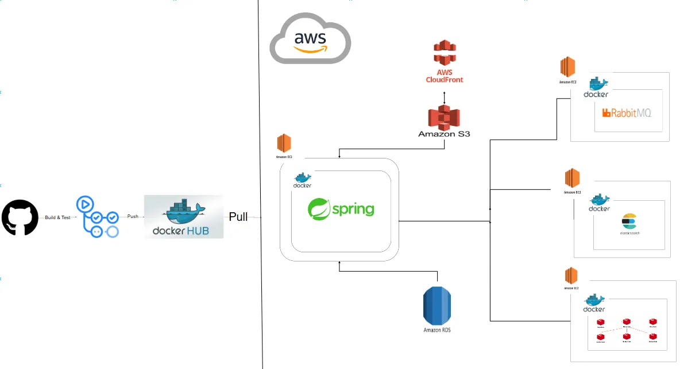

# CodeChef 

현업 개발자와 코린이를 위한 코드리뷰 커뮤니티
---

## KEY Summary

### 🍁 **성능 개선: **

1. **한 줄 요약**  
   - 
   - 

2. **도입 배경**  
   - 

3. **기술적 선택지**  
   - 
   - 

   **결론:** 

---

### 🍁 **트러블 슈팅: **

1. **문제**  
   - 실시간 게시물 랭킹 이나 유저 랭킹을 조회시에 어떠한 자료구조를 선택하는 것이 적합할까에 대해서 고민이 발생하였습니다.

   **해결 방안**  
   - 레디스의 Sorted Set 자료 구조를 사용하게 되었습니다.
     여러가지 자료구조 중(List,String,Set … 등등 ) Sorted Set을 사용하게 된 이유는, 
     점수나 조회수 기준으로 3등까지 랭킹을 조회해야하는 기능을 구현해야 했어야 했습니다.
     이러한 요구사항을 바탕으로 Sorted Set의 특징으로는 각 요소는 고유한 값(value)과 점수(score)를 가집니다 이러한 형태로 데이터를 삽입 하고, 
     데이터 삽입 시점에 점수를 기준으로 **자동으로 오름차순 정렬**이 되고, 정렬 연산 없이 정렬된 데이터를 효율적으로 조회 가능하고, 
     일반적인 시간 복잡도로는 **O(log(N))** 이므로 프로젝트에 랭킹 구현에 적합하다고 판단 했습니다.

2. **문제**  
   - 실시간 게시물 조회나 랭킹 조회시에 캐싱을 사용하는데 어떤식으로 레디스에 테이터를 관리하는것이 적합할까에 대해서 고민이 발생했습니다.

   **해결 방안**  
   - **Write-Through 및 Read-Through 전략 을 사용하게 되었습니다.**
     **쓰기전략에는 Write-Through 전략을 선택한 이유는 다음과 같습니다. 저희 프로젝트에는 캐싱과 db에 일관성 있는 데이터, 
     레디스의 최신 상태를 유지를 하는게 가장 중요하다고 판단 했습니다. 그래서 데이터 쓰기 시점에 DB와 레디스에 동시에 기록되고, 
     쓰**기 시점에 즉시 업데이트 되므로 캐시 데이터가 최신 데이터로 유지가 가능한**Write-Through 전략을 선택하게 되었습니다.**

     읽기전략에는 **Read-Through 전략**을 선택한 이유는 다음과 같습니다. 당시 프로젝트에 **조회 요청이 빈번하게 발생하며,
     빠른 응답 속도가 사용자 경험에 매우 중요**하다고 판단했기 때문입니다. Read-Through 전략은 데이터 조회시 **캐시에서 데이터를 우선적으로 조회**하고, 
     만약 캐시에 데이터가 없는 경우에만 **DB에서 데이터를 가져와 캐시에 저장**합니다. 이를 통해, **대부분의 읽기 요청을 캐시에서 처리**함으로써 DB 부하를 줄이고,
     **빠른 응답 속도**를 제공할 수 있습니다. 또한, 캐시 미스(Cache Miss) 발생 시 데이터를 자동으로 갱신하는 장점이 있어서 선택하게 되었습니다.

---

## 인프라 아키텍처 & 적용 기술

### 아키텍처 다이어그램

위 아키텍처는 **** 구조를 나타냅니다.  

<b>📦 적용 기술 상세보기</b>

### 💾 ****
- **Redis**  
  - 

### 📬 ****
- **Kafka**  
  - 

### 🌐 ****
- **Docker**  
  - 
- **Prometheus & Grafana**  
  - 

---

## 주요 기능

### 🍁 ****
- 
- 

### 🍁 ****
- 

### 🍁 ****
- 

---

## 역할 분담 및 협업 방식

### **Detail Role**

| 이름   | 포지션   | 담당(개인별 기여점)                                                                                                            | Github 링크                       |
|--------|----------|-----------------------------------------------------------------------------------------------------------------------------|-----------------------------------|
| 송민준 | 리더     | ▶ **ELK 스택**    - [Elasticsearch] 제목&내용&카테고리별 게시글 검색   - [Logstash] SearchService 로그 Elasticsearch에 저장   - [Kibana] Elasticsearch 시각화 & 실시간 인기 검색어 랭킹 Top10(검색 횟수 내림차순)   ▶ **인덱싱 (레거시)**   - 게시글 부분인덱싱   - 인덱스 검색 성능 테스트   ▶ **댓글 CRUD**   - 댓글 CRUD   - 댓글 채택   ▶ **카테고리 CRUD**   - 게시글 [프레임워크, 언어] CUD   - 유저 중간테이블 [프레임워크, 언어] CRD | [🍁 깃헙링크](https://github.com/Luta13) |
| 강이원 | 부리더   | ▶ **로그인/회원가입**   - Auth(user)-service CRUD   - JWT와 Spring Security를 이용한 보안 설정   - Redis를 이용한 Refresh Token 구현   ▶ **user 권한, 경고 구현**   - 관리자: 광고성, 코드리뷰 외 잡담 글 경고 부여   - 경고 횟수: 계정 BLOCK 처리   ▶ **Redis Sentinel 적용**   - Redis 초기 설정 및 연결 테스트   - Redis master-slave 구조 및 Sentinel 구축   ▶ **RabbitMQ 적용**   - RabbitMQ 초기 설정 및 연결 테스트   ▶ **배포 및 CI/CD**   - docker-compose 파일, dockerfile 작성   - EC2를 통한 서비스 배포   - Docker Hub에 도커 이미지 업로드   - GitHub Actions를 통한 CI/CD 설정   ▶ **실시간 게시물 랭킹 조회**   - Redis Sort Set을 이용해 랭킹 관리   - 스케줄러   - 1시간 간격으로 Redis 캐시 초기화   - **캐싱**   - Redis 캐싱을 통한 성능 최적화   - Cacheable을 이용한 캐싱   ▶ **실시간 알림 기능**   - 알림 전송 및 읽음 처리, 알람 조회, 읽지 않은 알람만 조회 기능 구현   - 댓글 작성 시 해당 게시글 작성자에게 알림 전송   - 이벤트 발생 시 알림 전송   - Slack (최종)   - RabbitMQ + Websocket (최종) | [🍁 깃헙링크](https://github.com/KangIWon) |
| 홍정기 | 팀원     | ▶ **게시물 작성 CRUD**   ▶ **이벤트 기능**   - 동시성 제어 방식의 발전 과정 및 성능 분석   - 최종: 분산락 사용   ▶ **인프라 CI/CD (리팩토링)**   - 한 서버에 통합되었던 Elasticsearch, Redis, RabbitMQ를 분산 배치 | [🍁 깃헙링크](https://github.com/jki09871) |
| 나민수 | 팀원     | ▶ **포인트**   - 포인트 지급, 포인트 차감, 포인트 조회   ▶ **포인트 랭킹 (Redis SortedSet, 캐싱)**   - 실시간 유저 랭킹 (현업자, 비현업자)   - 지난달 유저 랭킹 (현업자, 비현업자)   ▶ **CloudFront**   - 첨부파일을 S3에 저장 후 CloudFront로 반환   ▶ **결제**   - 구독 결제 & 환불 | [🍁 깃헙링크](https://github.com/minsoo-hub) |
| 강민주 | 팀원     | ▶ **첨부파일 CRUD**   - S3 Bucket   ▶ **실시간 채팅**   - 프로토콜: WebSocket, STOMP   - 메시지 브로커: RabbitMQ   - 메세징 패턴: Pub/Sub   - DB: Redis | [🍁 깃헙링크](https://github.com/MinjuKang) |

---

## 성과 및 회고

### 잘된 점
-
- 

### 아쉬운 점
- 

### 향후 계획
- 
- 
