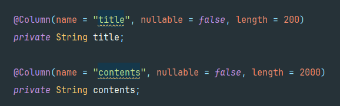
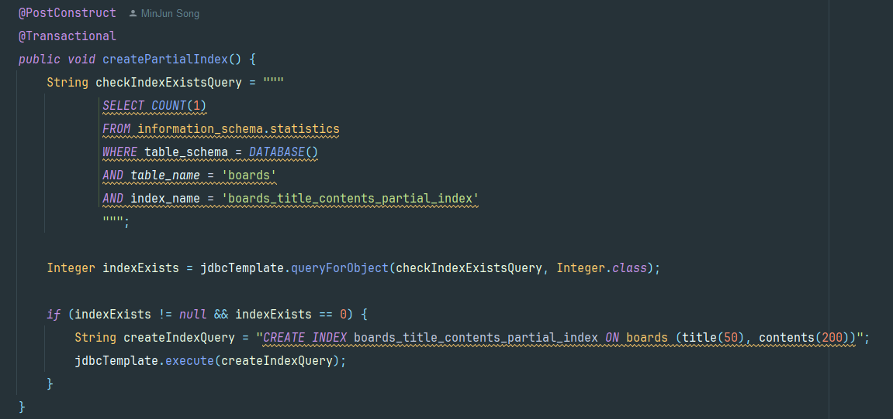
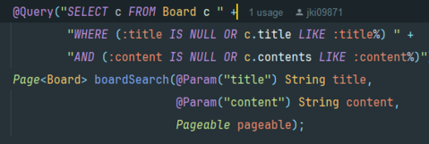
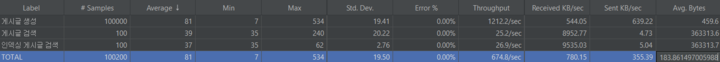
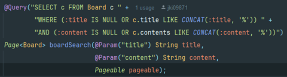
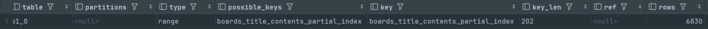

# CodeChef 

현업 개발자가 예비 개발자의 코드를 리뷰하고 성장하는 커뮤니티 입니다.
---

## KEY Summary

### 🍁 **기술적 의사 결정: Elasticsearch를 사용해 랭킹 시스템을 구현한 이유 **

1. **배경**
   - 코드 리뷰 커뮤니티에선 코드에 대한 문제를 해결하거나, 정보를 찾기 위해 키워드로 검색을 많이 시도합니다.
     그러므로 사용자들이 자주 검색하는 키워드를 랭킹으로 보여주면 비슷한 문제를 가진 사용자들이 관련 질문과 답변을 쉽게 찾을 수 있습니다.
     또 주요 주제가 실시간으로 반영되면서, 커뮤니티의 흐름을 파악하는것이 중요했습니다.

2. **선택지**
   1. MySQL을 사용하여 검색어와 검색 횟수를 DB에 저장하고, SQL 쿼리를 사용해 랭킹 계산하는 방법
   2. Redis의 ZSet을 사용하여 실시간 검색어 랭킹 계산하는 방법
   3. Elasticsearch의 Terms Aggregation을 사용하여 랭킹 계산하는 방법

3. **요구사항**
   1. 특정 기간 동안 검색된 검색어 중 **가장 많이 검색된 10개 키워드**와 해당 **검색 횟수**를 집계하여 반환해야 한다.
   2. 검색어는 로그로 저장되며, 대규모 데이터에도 처리가 적합하여야 한다.
   3. 새로운 검색 요청이 들어올 경우, 해당 데이터는 실시간으로 저장되고 다음 랭킹 결과에 반영되어야 한다.

4. **도입 이유 및 해결 방안**
   - MySQL은 데이터의 일관성 유지와 데이터 저장에 강점이 있고 복잡한 쿼리의 처리가 가능하지만, 실시간 업데이트에 취약하고 대규모 데이터 처리에서 비효율적입니다.
      
     Redis의 ZSet은 실시간 업데이트 측면에서는 적합하지만, 메모리 기반으로 동작하므로 저장 가능한 데이터의 크기가 서버 메모리 용량에 의존합니다.
     즉, 검색 로그가 점점 증가하면, 메모리 한계로 인해 데이터 손실이나 성능 저하가 발생할 수 있습니다. 또한 별도의 시각화가 어렵다는 단점이 있습니다.
   
     Elasticsearch는 Redis에 비해 대규모 데이터 처리에 적합할 뿐만 아니라, Terms Aggregation 기능으로 다양한 필터링 기능을 쉽게 추가할 수 있습니다. 또한, Kibana를 통해 손쉽게 데이터 시각화도 가능합니다.
     그러므로 우리 프로젝트에선 Elasticsearch를 사용하여 실시간 인기 검색어 랭킹을 구현하기로 결정하였습니다.
---

### 🍁 **트러블 슈팅: **

1. **문제**  
   - 실시간 게시물 랭킹 이나 유저 랭킹을 조회시에 어떠한 자료구조를 선택하는 것이 적합할까에 대해서 고민이 발생하였습니다.

   **해결 방안**  
   - 레디스의 Sorted Set 자료 구조를 사용하게 되었습니다.
     여러가지 자료구조 중(List,String,Set … 등등 ) Sorted Set을 사용하게 된 이유는, 
     점수나 조회수 기준으로 3등까지 랭킹을 조회해야하는 기능을 구현해야 했어야 했습니다.
     이러한 요구사항을 바탕으로 Sorted Set의 특징으로는 각 요소는 고유한 값(value)과 점수(score)를 가집니다 이러한 형태로 데이터를 삽입 하고, 
     데이터 삽입 시점에 점수를 기준으로 **자동으로 오름차순 정렬**이 되고, 정렬 연산 없이 정렬된 데이터를 효율적으로 조회 가능하고, 
     일반적인 시간 복잡도로는 **O(log(N))** 이므로 프로젝트에 랭킹 구현에 적합하다고 판단 했습니다.

2. **문제**  
   - 실시간 게시물 조회나 랭킹 조회시에 캐싱을 사용하는데 어떤식으로 레디스에 테이터를 관리하는것이 적합할까에 대해서 고민이 발생했습니다.

   **해결 방안**  
   - **Write-Through 및 Read-Through 전략 을 사용하게 되었습니다.**
     **쓰기전략에는 Write-Through 전략을 선택한 이유는 다음과 같습니다. 저희 프로젝트에는 캐싱과 db에 일관성 있는 데이터, 
     레디스의 최신 상태를 유지를 하는게 가장 중요하다고 판단 했습니다. 그래서 데이터 쓰기 시점에 DB와 레디스에 동시에 기록되고, 
     쓰**기 시점에 즉시 업데이트 되므로 캐시 데이터가 최신 데이터로 유지가 가능한**Write-Through 전략을 선택하게 되었습니다.**

     읽기전략에는 **Read-Through 전략**을 선택한 이유는 다음과 같습니다. 당시 프로젝트에 **조회 요청이 빈번하게 발생하며,
     빠른 응답 속도가 사용자 경험에 매우 중요**하다고 판단했기 때문입니다. Read-Through 전략은 데이터 조회시 **캐시에서 데이터를 우선적으로 조회**하고, 
     만약 캐시에 데이터가 없는 경우에만 **DB에서 데이터를 가져와 캐시에 저장**합니다. 이를 통해, **대부분의 읽기 요청을 캐시에서 처리**함으로써 DB 부하를 줄이고,
     **빠른 응답 속도**를 제공할 수 있습니다. 또한, 캐시 미스(Cache Miss) 발생 시 데이터를 자동으로 갱신하는 장점이 있어서 선택하게 되었습니다.

---

## 인프라 아키텍처 & 적용 기술

### 아키텍처 다이어그램

위 아키텍처는 **** 구조를 나타냅니다.  

<b>📦 적용 기술 상세보기</b>

### 💾 ****
- **Redis**  
  - 

### 📬 **메시징 시스템**
- **Kafka**  
  - 

### 🌐 **인프라 및 배포**
- **Docker**  
  - 
- **Prometheus & Grafana**  
  - 

## 주요 기능

### 🍁 **검색 : Elasticsearch를 사용한 검색 기능 구현**
- Elasticsearch를 사용하여 게시글 검색 기능 구현

### 🍁 ****
- 

### 🍁 ****
- 

---

## 기술적 고도화

<b>🍁 인덱스 도입으로 검색 성능 30% 개선</b>

[문제 인식]

게시글 검색을 위해 풀 테이블 스캔을 하는건 너무 비효율적이고 성능 소비가 심하다.

대량의 데이터가 생길수록 응답 속도는 더 큰 차이를 보인다. 그래서 풀 테이블 스캔이 아니라, 인덱스를 생성하여 데이터 조회 속도를 높이고, 리소스 사용을 최적화 한다.

인덱스

책의 색인처럼 특정 데이터를 빠르게 찾을 수 있도록 하는 특별한 데이터 구조이다.

- **B-Tree 인덱스**: 범위 검색, 정렬된 데이터 조회에 적합하여 대부분의 데이터베이스에서 기본적으로 사용된다.
- **Hash 인덱스**: 특정 값과 일치하는 데이터를 찾는 데 빠르며, 범위 검색에는 적합하지 않다.

[선택 이유]

- **검색 속도를 높인다**: 인덱스가 있으면 특정 데이터 위치를 바로 찾아가니까 전체 테이블을 검색할 필요 없이 빠르게 결과를 얻는다.
- **응답 시간을 줄인다**: 쿼리 실행 시 필요한 데이터만 추려내기 때문에, 응답 시간이 짧아져 사용자에게 빠르게 결과를 보여준다.
- **데이터베이스 성능을 개선한다**: 인덱스를 사용하면 데이터베이스가 더 적은 자원으로 원하는 데이터를 찾아내 성능이 전반적으로 향상된다.
- **처리 부담을 낮춘다**: 전체 테이블 스캔을 하면 데이터가 많아질수록 부담이 커지지만, 인덱스는 필요한 데이터만 조회하기 때문에 부담이 훨씬 덜하다.
- **쿼리 최적화를 돕는다**: 인덱스가 적절하게 설정되어 있으면 복잡한 쿼리에서도 최적의 검색 경로를 찾을 수 있어 쿼리가 효율적으로 실행된다

[해결 방안]	

Board 엔티티에 @Index 어노테이션을 설정하여, 기본 인덱스를 설정하였다.

하지만 애플리케이션 실행 중, 오류가 발생하였는데, MYSQL의 InnoDB는 인덱스의 최대 크기를 3072byte로 제한을 한다.

Board 엔티티의 title과 contents를 중심으로 검색하려고 하면, 4 * 2200 즉 8800바이트가 발생한다.

그래서 우리는 기본 인덱스를 사용하지 않고, 이를 해결해줄 수 있는 부분 인덱스를 사용하기로 한다.

애플리케이션을 실행할 때 Local에서 CREATE INDEX boards_title_contents_partial_index ON boards (title(50), contents(200))”; 쿼리를 실행한다.

이는 title의 길이 50, contents의 길이 200까지만 인덱스를 설정한다는 뜻이다.

그래서 인덱스를 부분으로 걸어 인덱스의 크기를 줄이고 저장 공간을 절약한다.

인덱싱이 정상적으로 등록됐다.

10만개의 더미 데이터를 넣고 조회를 100번 하여 성능 비교를 했는데 놀랍게도 차이가 없다.

확인 해보니 LIKE문에서 인덱스을 걸려면 CONCAT문과 함께 사용해야 한다.

코드를 이렇게 수정하면 인덱스가 적용 된다.

type = range로 boardSearch 쿼리 인덱싱 적용 완료 확인

[해결 완료]
- 결과

| 처리 방식 | 평균 응답시간 | 처리량 | 표준 편차 | 최소 응답시간 | 최대 응답시간 |
| --- | --- | --- | --- | --- | --- |
| 인덱스 | 38 | 25.9/sec | 2.83 | 37 | 65 |
| DB | 54 | 18.4/sec | 1.17 | 53 | 62 |

인덱싱을 적용한 쿼리가 이전 쿼리에 비해 약 30%의 빠른 평균 응답 속도와 처리량을 보인다.

---

## 역할 분담 및 협업 방식

### **Detail Role**

| 이름   | 포지션   | 담당(개인별 기여점)                                                                                                            | Github 링크                       |
|--------|----------|-----------------------------------------------------------------------------------------------------------------------------|-----------------------------------|
| 송민준 | 리더     | ▶ **ELK 스택**    - [Elasticsearch] 제목&내용&카테고리별 게시글 검색   - [Logstash] SearchService 로그 Elasticsearch에 저장   - [Kibana] Elasticsearch 시각화 & 실시간 인기 검색어 랭킹 Top10(검색 횟수 내림차순)   ▶ **인덱싱 (레거시)**   - 게시글 부분인덱싱   - 인덱스 검색 성능 테스트   ▶ **댓글 CRUD**   - 댓글 CRUD   - 댓글 채택   ▶ **카테고리 CRUD**   - 게시글 [프레임워크, 언어] CUD   - 유저 중간테이블 [프레임워크, 언어] CRD | [🍁 깃헙링크](https://github.com/Luta13) |
| 강이원 | 부리더   | ▶ **로그인/회원가입**   - Auth(user)-service CRUD   - JWT와 Spring Security를 이용한 보안 설정   - Redis를 이용한 Refresh Token 구현   ▶ **user 권한, 경고 구현**   - 관리자: 광고성, 코드리뷰 외 잡담 글 경고 부여   - 경고 횟수: 계정 BLOCK 처리   ▶ **Redis Sentinel 적용**   - Redis 초기 설정 및 연결 테스트   - Redis master-slave 구조 및 Sentinel 구축   ▶ **RabbitMQ 적용**   - RabbitMQ 초기 설정 및 연결 테스트   ▶ **배포 및 CI/CD**   - docker-compose 파일, dockerfile 작성   - EC2를 통한 서비스 배포   - Docker Hub에 도커 이미지 업로드   - GitHub Actions를 통한 CI/CD 설정   ▶ **실시간 게시물 랭킹 조회**   - Redis Sort Set을 이용해 랭킹 관리   - 스케줄러   - 1시간 간격으로 Redis 캐시 초기화   - **캐싱**   - Redis 캐싱을 통한 성능 최적화   - Cacheable을 이용한 캐싱   ▶ **실시간 알림 기능**   - 알림 전송 및 읽음 처리, 알람 조회, 읽지 않은 알람만 조회 기능 구현   - 댓글 작성 시 해당 게시글 작성자에게 알림 전송   - 이벤트 발생 시 알림 전송   - Slack (최종)   - RabbitMQ + Websocket (최종) | [🍁 깃헙링크](https://github.com/KangIWon) |
| 홍정기 | 팀원     | ▶ **게시물 작성 CRUD**   ▶ **이벤트 기능**   - 동시성 제어 방식의 발전 과정 및 성능 분석   - 최종: 분산락 사용   ▶ **인프라 CI/CD (리팩토링)**   - 한 서버에 통합되었던 Elasticsearch, Redis, RabbitMQ를 분산 배치 | [🍁 깃헙링크](https://github.com/jki09871) |
| 나민수 | 팀원     | ▶ **포인트**   - 포인트 지급, 포인트 차감, 포인트 조회   ▶ **포인트 랭킹 (Redis SortedSet, 캐싱)**   - 실시간 유저 랭킹 (현업자, 비현업자)   - 지난달 유저 랭킹 (현업자, 비현업자)   ▶ **CloudFront**   - 첨부파일을 S3에 저장 후 CloudFront로 반환   ▶ **결제**   - 구독 결제 & 환불 | [🍁 깃헙링크](https://github.com/minsoo-hub) |
| 강민주 | 팀원     | ▶ **첨부파일 CRUD**   - S3 Bucket   ▶ **실시간 채팅**   - 프로토콜: WebSocket, STOMP   - 메시지 브로커: RabbitMQ   - 메세징 패턴: Pub/Sub   - DB: Redis | [🍁 깃헙링크](https://github.com/MinjuKang727) |

---

## 성과 및 회고

### 잘된 점
- 송민준 : Elasticsearch를 사용하여 게시글 검색 부문 최적화를 하였음.
- 강이원 : 프로젝트에 필요한 여러 기술들의 초기 설정과 배포 및 CI/CD를 맡아서 프로젝트의 발판을 마련함.
- 홍정기 : 모든 서비스를 하나의 EC2에서 분리하여 각각의 EC2에 배포해 관리와 확장성을 개선함.
- 나민수 : 레디스 캐싱 전략을 찾아보고 프로젝트에 적합한 전략을 적용함.
- 강민주 : 프로토콜, 메세징 패턴, 메세지 브로커 선정의 각 과정을 심도있게 고민하고 메세지 브로커를 단계적으로 도입한 점, 그동안 튜터님께 피드백 받은 내용을 참고하여 코딩에 녹여내려 했던 부분이 좋았음. 전 과정을 꼼꼼하게 문서화, 영상화 한 점이 좋았음.

### 아쉬운 점
- 송민준 : 유사 검색을 구현하지 못해 사용자가 검색을 할 때 관련된 문제를 찾기 힘듦.
- 강이원 : Kafka를 최종 목표로 구현을 하려 했지만 구현을 하지 못했음.
- 홍정기 : ECS, 로드 밸런서, 오토스케일링을 활용한 자동화와 확장성 구현을 하지 못함.
- 나민수 : 결제 부분을 여러가지 시나리오에 대해서 자세하게 구현하지 못함.
- 강민주 : 메세지 발행 및 구독 기능만 구현하여 RabbitMQ의 외부 메세지 브로커로서의 장점(ex. 확장성, 메세지 전송 보장 등)을 잘 살리지 못하였음. 외부 메세지를 도입하였지만 실시간 채팅과 알람 기능 구현에만 사용한 것도 조금 아쉬움.

### 향후 계획
- 송민준 : 기존 검색 서비스의 로그 말고도 다양한 서비스 레이어의 로그를 수집하여 전체 시스템의 성능, 병목 현상, 에러를 파악하고
  최적화, 개선하고 싶습니다.
- 강이원 : Kafka로의 전환: 높은 트래픽 처리와 메시지 영속성을 고려하여 RabbitMQ에서 Kafka로 메시징 시스템을 전환해볼 것 같습니다. 대규모 데이터 스트리밍을 효율적으로 처리하고 다양한 분석 및 실시간 데이터 처리가 가능하게 하기 위해서 입니다.
- 홍정기 : ECS와 Fargate를 도입해 컨테이너 기반 자동 확장성을 구현하고 서비스 관리 부담을 줄이는 한편, 로드 밸런서를 활용해 트래픽을 효율적으로 분산시키고 서비스 가용성과 안정성을 더욱 강화할 계획입니다.
- 나민수 : 구독 부분에 조금더 안정적으로 구독 서비스를 사용할수 있도록  결제& 환불시 일어날수 있는 상황들을 더 생각해보고,
 추가적으로 개선해고싶습니다.
- 강민주 : RabbitMQ를 외부 메세지 브로커로 다중 서버 환경에서 메세지 동기화 구현 및 최적화,
외부 메세지 브로커를 실시간 채팅과 이벤트 알람 용으로만 사용하고 있는데 팀원의 동시성 문제에서 순서 보장 문제 해결 부분에도 작업 큐로 도입해 보면 좋을 것 같음.
